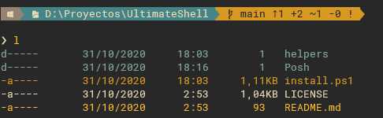
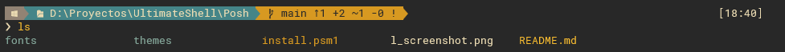

# Windows Terminal Themes

## Oh my Posh!

We will use [Oh-My-Posh](https://github.com/JanDeDobbeleer/oh-my-posh) to modify Powershell themes

## Awesome Suampa theme customization to make your eyes happier!

In order to get a gratefull experience we've developed a customized theme based on [Agnoster](https://github.com/JanDeDobbeleer/oh-my-posh#agnoster)
but with custom icons and colors customized for a windows environment.


To get a better navigation experience we've added [PSReadLine](https://github.com/PowerShell/PSReadLine) module to use a beautifull autocompletion tapping **Tab**


To get a unix-like experience listing directories we will use [get-childitemcolor](https://github.com/joonro/Get-ChildItemColor)

*l example*



*ls example*



## Custom window terminal settings

We recommend to change window terminal settings to if you want to see the theme at its maximum splendor.

To make your life easier here you have my configuration, the things you must change are:

- Window Powershell
    - fontSize: set it with the size that fit your visual preferences
    - fontFace: RobotoMono Nerd Font allow us to print icons in powershell line.
    - colorScheme: we use gruvbox colorscheme to match vim colorscheme, it's not mandatory, but if you want to shine you must use it ;)

- Schemes: If you use our gruvbox scheme in powershell you should paste our scheme in your settings too
- Actions: These are my personal keybindings, just if you want to test them

## My wonderfull powershell configuration 

```jsonc
{
    "$schema": "https://aka.ms/terminal-profiles-schema",

    "defaultProfile": "{61c54bbd-c2c6-5271-96e7-009a87ff44bf}",

    // You can add more global application settings here.
    // To learn more about global settings, visit https://aka.ms/terminal-global-settings

    // If enabled, selections are automatically copied to your clipboard.
    "copyOnSelect": false,

    // If enabled, formatted data is also copied to your clipboard
    "copyFormatting": false,
    // A profile specifies a command to execute paired with information about how it should look and feel.
    // Each one of them will appear in the 'New Tab' dropdown,
    //   and can be invoked from the commandline with `wt.exe -p xxx`
    // To learn more about profiles, visit https://aka.ms/terminal-profile-settings
    "profiles":
    {
        "defaults":
        {
            // Put settings here that you want to apply to all profiles.
        },
        "list":
        [
            {
                // Make changes here to the powershell.exe profile.
                "guid": "{61c54bbd-c2c6-5271-96e7-009a87ff44bf}",
                "name": "Windows PowerShell",
                "fontSize": 10,
                "colorScheme": "Gruvbox Dark Modified",
                "commandline": "powershell.exe",
                "fontFace": "RobotoMono Nerd Font",
                "hidden": false
            },
            {
                // Make changes here to the cmd.exe profile.
                "guid": "{0caa0dad-35be-5f56-a8ff-afceeeaa6101}",
                "name": "Símbolo del sistema",
                "commandline": "cmd.exe",
                "hidden": false
            },
            {
                "guid": "{2c4de342-38b7-51cf-b940-2309a097f518}",
                "hidden": false,
                "name": "Ubuntu",
                "colorScheme": "Gruvbox Dark",
                "background": "#282828",
                "fontFace": "RobotoMono Nerd Font",
                "fontSize": 11,
                "source": "Windows.Terminal.Wsl"
            },
            {
                "guid": "{b453ae62-4e3d-5e58-b989-0a998ec441b8}",
                "hidden": false,
                "name": "Azure Cloud Shell",
                "source": "Windows.Terminal.Azure"
            }
        ]
    },

    // Add custom color schemes to this array.
    // To learn more about color schemes, visit https://aka.ms/terminal-color-schemes
    "schemes": [
        {
            "background" : "#282828",
            "black" : "#282828",
            "blue" : "#458588",
            "brightBlack" : "#928374",
            "brightBlue" : "#83A598",
            "brightCyan" : "#8EC07C",
            "brightGreen" : "#B8BB26",
            "brightPurple" : "#D3869B",
            "brightRed" : "#FB4934",
            "brightWhite" : "#EBDBB2",
            "brightYellow" : "#FABD2F",
            "cyan" : "#689D6A",
            "foreground" : "#EBDBB2",
            "green" : "#98971A",
            "name" : "Gruvbox Dark Modified",
            "purple" : "#B16286",
            "red": "#d84f56",
            "white" : "#A89984",
            "yellow" : "#D79921"
        }
    ],

    // Add custom actions and keybindings to this array.
    // To unbind a key combination from your defaults.json, set the command to "unbound".
    // To learn more about actions and keybindings, visit https://aka.ms/terminal-keybindings
    "actions":
    [
        // Copy and paste are bound to Ctrl+Shift+C and Ctrl+Shift+V in your defaults.json.
        // These two lines additionally bind them to Ctrl+C and Ctrl+V.
        // To learn more about selection, visit https://aka.ms/terminal-selection
        { "command": {"action": "copy", "singleLine": false }, "keys": "ctrl+c" },
        { "command": "paste", "keys": "ctrl+shift+v" },

        // Press Ctrl+Shift+F to open the search box
        { "command": "find", "keys": "ctrl+shift+f" },
        {"command": "tabSearch", "keys": "alt+space"},

        // Press Alt+Shift+D to open a new pane.
        // - "split": "auto" makes this pane open in the direction that provides the most surface area.
        // - "splitMode": "duplicate" makes the new pane use the focused pane's profile.
        // To learn more about panes, visit https://aka.ms/terminal-panes
        { "command": { "action": "splitPane", "split": "auto", "splitMode": "duplicate" }, "keys": "alt+shift+d" },

        { "command": { "action": "moveFocus", "direction": "down" }, "keys": "alt+down" },
        { "command": { "action": "moveFocus", "direction": "up" }, "keys": "alt+up" },
        { "command": { "action": "moveFocus", "direction": "left" }, "keys": "alt+left" },
        { "command": { "action": "moveFocus", "direction": "right" }, "keys": "alt+right" },
        { "command": { "action": "resizePane", "direction": "down" }, "keys": "alt+shift+down" },
        { "command": { "action": "resizePane", "direction": "left" }, "keys": "alt+shift+left" },
        { "command": { "action": "resizePane", "direction": "right" }, "keys": "alt+shift+right" },
        { "command": { "action": "resizePane", "direction": "up" }, "keys": "alt+shift+up" },
        { "command": "scrollUp", "keys": "ctrl+alt+k" },
        { "command": "scrollDown", "keys": "ctrl+alt+j" }
    ],
}

```
