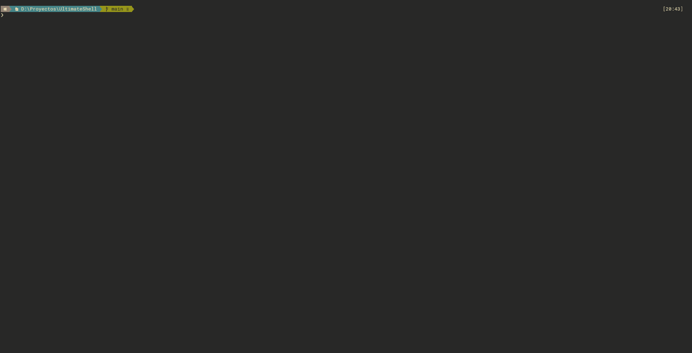

# UltimateShell

Configuration of PowerShell with nice theme colors and neo vim configuration

This shell will install:

- [Chocolatey](https://chocolatey.org/)
- [Windows Terminal](https://www.microsoft.com/es-es/p/windows-terminal/9n0dx20hk701?rtc=1)
- [Vimified Explorer](https://github.com/sahilsehwag/AHK-VimifiedExplorer)
- [Oh-my-Posh](https://github.com/JanDeDobbeleer/oh-my-posh)
- [Neovim](https://neovim.io)

Additionally we've added some fixes to get a good and powerfull work environment.

## Install

Just type ./install.ps1 follow steps and enjoy!

## Aliases

You can add some alias to your profile if you want using this script

- evim: edit vim profile
- eprof: edit windows profile
- sprof: apply windows profile changes in current terminal